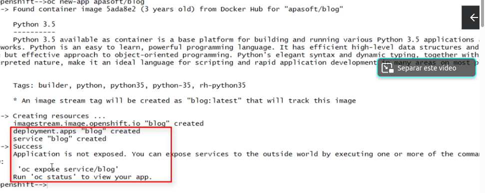

- S2I Source to image buirlder
- pasos despliegue de una aplicacion
	- oc new-app apasoft/blog
	- 
	- oc expose service/blog
	- oc get is
	- oc describe is blog
	- is -> image stream
	- oc get images
	- oc get deploy
	- oc get svc
	- oc get route
	-
- oc new-app --name=nginx10 --as-deployment-config=true --image=nginx
	- oc get dc
	- oc get pod -> sale el pod de construcion y el que se esta construyendo
	-
- oc get all -l app=mi-nube
- oc new-app --name=ejemplo --image=tomcat -o yaml > tomcat.yaml
	- genera los ficheros pero sin lanzarlos
- oc get is -n openshift
- oc get images -n openshift
-
- Instalacion de un wordpress
	- oc  new-project wordpress
	- oc new-app mysql:5.7 --name=mysql1 -e MYSQL_ROOT_PASSWORD=secret -e \ MYSQL_USER=usu1 -e MYSQL_PASSWORD=secret MYSQL_DATABASE=wordpress
	- oc new-app wordpress --name=wordpress1 -e WORDPRESS_DB_HOST=mysql1 -e \ WORDPRESS_DB_USER=usu1 -e WORDPRESS_DB_PASSWORD=secret -e\ 
	  WORDPRESS_DB_NAME=wordpress
	- oc expose svc wordpress1
	- oc get dc
	- oc get rc
	- oc get pod
	- oc get svc
	- oc get is
	- oc get route
-